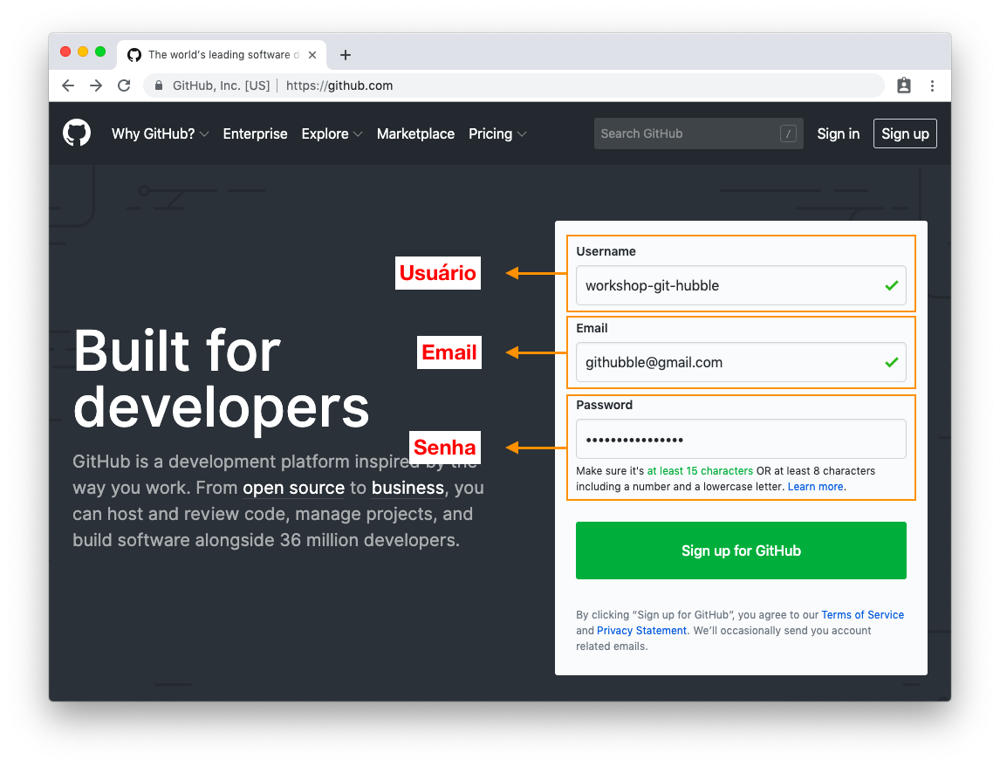
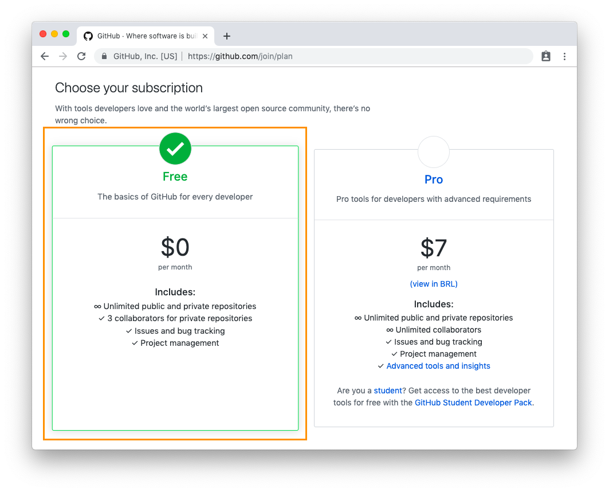
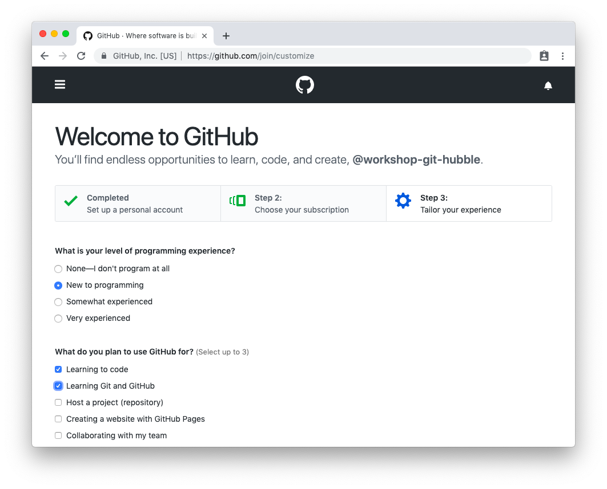
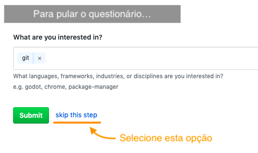
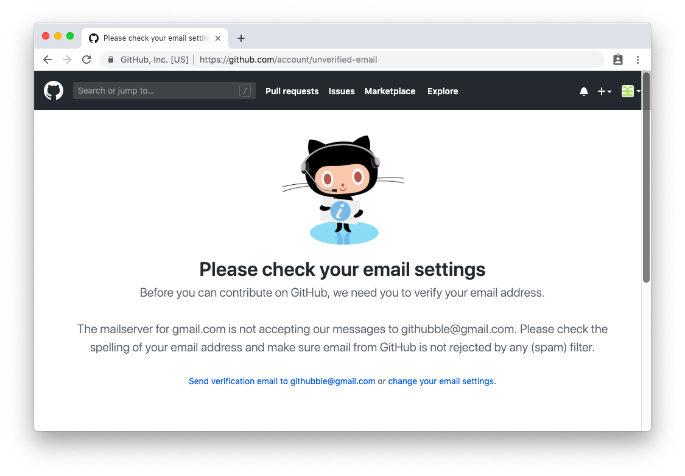

# Passo 1 - Criar conta no GitHub

Caso você ainda não possua uma conta no GitHub, acesse o [site do GitHub](https://github.com/) para fazer o seu cadastro.

1. Na tela inicial, insira os dados que você utilizará para fazer login no sistema.

2. No próximo passo, escolha o plano gratuito (com ele, você conseguirá realizar as atividades deste workshop).

3. No último passo, responda o formulário apresentado. O formulário irá traçar o seu perfil de usuário para gerar recomendações de projetos que podem ser do seu interesse (você pode pular o questionário no final da página).

4. Após realizados esses passos, a sua conta terá sido criada. Caso ao finalizar o processo você veja uma tela semelhante à da seguinte imagem, talvez você precise verificar a sua conta de email através do link enviado para a sua caixa de entrada para conseguir utilizar dos serviços do GitHub.

